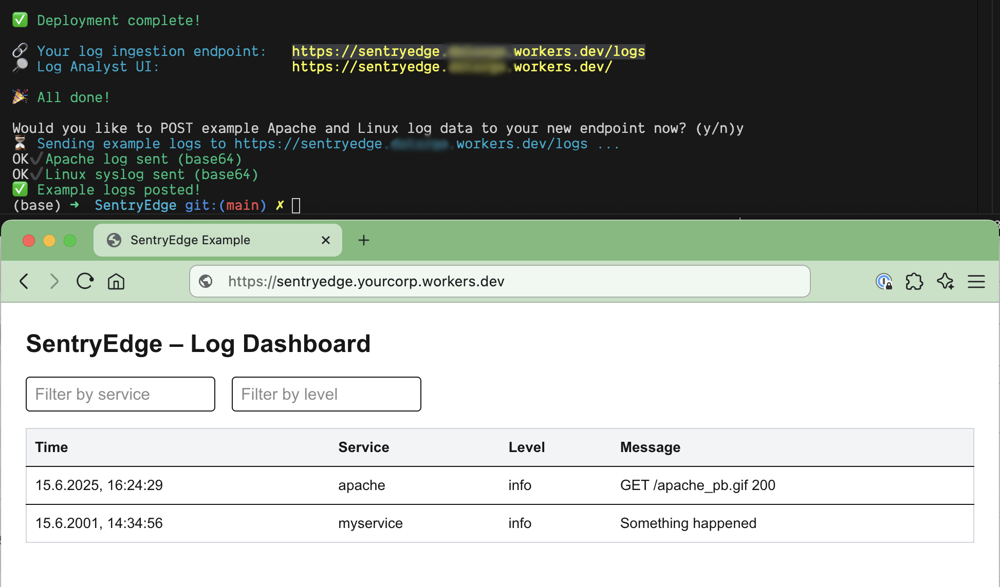

# SentryEdge Worker

SentryEdge is an open-source logging tool that demonstrates how easy and fast it is to build and deploy modern solutions with Cloudflare. Thanks to Cloudflare Workers and the D1 database, you can create your own logging and monitoring services in minutes instead of days or months, without complex infrastructure or expensive SaaS providers. Cloudflare makes "vibe coding" productive: develop, deploy, and run your own services directly at the edge, flexible, cost-effective, and with full data ownership. SentryEdge is an example of how you can use Cloudflare to deliver professional tools for security, observability, and more in no time.
This project uses [Cloudflare](https://www.cloudflare.com/) [Workers](https://workers.cloudflare.com/) and [D1](https://www.cloudflare.com/products/d1/) as a database for storing and analyzing logs.

SentryEdge is also an ideal foundation for extending with [Cloudflare Zero Trust](https://www.cloudflare.com/products/zero-trust/), [Cloudflare Pub/Sub](https://developers.cloudflare.com/pub-sub/), or even [Cloudflare AutoRAG](https://developers.cloudflare.com/ai-gateway/autorag/) for advanced anomaly detection and secure, scalable event-driven architectures.

<p align="center">
  
</p>


## Table of Contents


- [SentryEdge Worker](#sentryedge-worker)
  - [Table of Contents](#table-of-contents)
  - [Prerequisites](#prerequisites)
  - [Installation](#installation)
    - [What `deploy.sh` Does](#what-deploysh-does)
    - [Manual Deployment Steps](#manual-deployment-steps)
  - [Supported Log Formats](#supported-log-formats)
  - [Extending or Modifying the Parser](#extending-or-modifying-the-parser)
  - [Log Ingestion Options](#log-ingestion-options)
    - [1. Structured JSON](#1-structured-json)
    - [2. Raw Log Line (Plain Text)](#2-raw-log-line-plain-text)
    - [3. Raw Log Line (Base64 Encoded)](#3-raw-log-line-base64-encoded)
    - [4. Legacy/Custom JSON](#4-legacycustom-json)
    - [5. Unknown/Automatic Format Detection](#5-unknownautomatic-format-detection)
  - [Log Ingestion Examples](#log-ingestion-examples)
  - [⚠️ CORS Warning](#️-cors-warning)
  - [Authentication and Authorization](#authentication-and-authorization)
  - [Contributing](#contributing)
  - [License](#license)


## Prerequisites

Node.js (v18 or newer) available at [nodejs.org](https://nodejs.org/)
npm available at [npmjs.com](https://www.npmjs.com/)
Wrangler CLI available at [Cloudflare Workers documentation](https://developers.cloudflare.com/workers/wrangler/)

## Installation

To install and deploy SentryEdge, simply run:

```sh
./deploy.sh
```

This script will handle all setup, including installing dependencies, creating the D1 database, updating configuration, building the UI, and deploying the Worker. No manual steps or extra scripts are required.

---

### What `deploy.sh` Does

The `deploy.sh` script automates the entire deployment process for your SentryEdge project. Here’s what it does, step by step:

1. **Ensures Wrangler CLI is installed**
   - Checks if the Cloudflare Wrangler CLI is available.
   - If not, installs it globally using npm.

2. **Ensures you are logged in to Cloudflare**
   - Checks if you are authenticated with Wrangler.
   - If not, runs `wrangler login` to prompt you to log in.

3. **Ensures the D1 database exists**
   - Checks if a D1 database named `sentryedge` exists in your Cloudflare account.
   - If not, creates it using `wrangler d1 create sentryedge`.

4. **Extracts and updates the D1 `database_id`**
   - Extracts the `database_id` for the `sentryedge` database (whether newly created or already existing) using a robust, portable shell command.
   - Updates the `database_id` field in `worker/wrangler.toml` so your Worker is always connected to the correct database.

5. **Applies D1 migrations**
   - Runs `wrangler d1 migrations apply sentryedge` to ensure your database schema is up to date.

6. **Builds the Next.js UI**
   - Changes to the `ui` directory.
   - Installs dependencies (`npm install`).
   - Builds the static UI (`npm run build`).

7. **Copies static UI files to the Worker**
   - Copies the built static files from `ui/out/` to `worker/public/`, ensuring the Worker serves the latest UI.

8. **Installs Worker dependencies**
   - Changes to the `worker` directory.
   - Installs dependencies (`npm install`).

9. **Deploys the Worker**
   - Runs `wrangler deploy` to deploy your Worker (and static UI) to Cloudflare.

---

### Manual Deployment Steps

If you want to perform the deployment manually, follow these steps in your terminal:

1. **Install Wrangler CLI (if not already installed)**
   ```sh
   npm install -g wrangler
   ```

2. **Log in to Cloudflare (if not already logged in)**
   ```sh
   wrangler login
   ```

3. **Ensure the D1 database exists**
   ```sh
   wrangler d1 list | grep 'sentryedge'
   # If you see no output, create it:
   wrangler d1 create sentryedge
   ```

4. **Extract and update the `database_id` in `worker/wrangler.toml`**
   ```sh
   D1_ID=$(wrangler d1 list | grep 'sentryedge' | grep -Eo '[a-f0-9-]{32,}')
   echo "Database ID: $D1_ID"
   sed -i '' "s|^database_id = \".*\"|database_id = \"$D1_ID\"|" worker/wrangler.toml
   # (On Linux, use `sed -i` without `''`.)
   ```

5. **Build the Next.js UI**
   ```sh
   cd ui
   npm install
   npm run build
   cd ..
   ```

6. **Copy static UI files to the Worker**
   ```sh
   mkdir -p worker/public
   rsync -a --delete ui/out/ worker/public/
   ```

7. **Install Worker dependencies**
   ```sh
   cd worker
   npm install
   cd ..
   ```

8. **Apply D1 migrations**
   ```sh
   wrangler d1 migrations apply sentryedge
   ```

9. **Deploy the Worker**
   ```sh
   cd worker
   wrangler deploy
   cd ..
   ```

You can run all these steps manually, or simply use `./deploy.sh` to automate the process. The script ensures your Cloudflare Worker, static UI, and D1 database are always in sync and ready for production.

---

**To run the Worker locally for development:**

From the `worker` directory, start the development server:

```sh
cd worker
npm run start
```

or

```sh
wrangler dev
```

The worker will be available at the local address provided by Wrangler.

## Supported Log Formats

SentryEdge can automatically parse and normalize log lines from a variety of common sources. The following formats are supported out of the box:

| Format                  | Example / Notes                                      |
|-------------------------|------------------------------------------------------|
| Apache access log       | `127.0.0.1 - - [15/Jun/2025:12:34:56 +0000] ...`     |
| Nginx access log        | `192.168.1.1 - - [15/Jun/2025:12:34:56 +0000] ...`   |
| Linux syslog            | `Jun 15 12:34:56 myhost myservice: Something ...`    |
| Windows Event Log       | JSON or XML event log lines                          |
| Docker JSON log         | `{ "log": "...", "time": "..." }`                 |
| Kubernetes JSON log     | `{ "log": "...", "stream": "stdout", ... }`        |
| AWS CloudWatch log      | `{ "timestamp": ..., "message": "..." }`           |
| pfSense log             | `Jun 15 12:34:56 filterlog: ...`                     |
| PostgreSQL log          | `2025-06-15 12:34:56 UTC [1234] ...`                 |
| MySQL log               | `2025-06-15T12:34:56.789012Z ...`                    |
| Generic JSON log        | `{ "message": "...", "timestamp": "..." }`         |
| Key-value log           | `foo=bar baz=qux`                                    |
| Custom/legacy formats   | Fallback or extendable via parser                    |

The parser will auto-detect the format and extract fields like `timestamp`, `service`, `level`, and `message`.


## Extending or Modifying the Parser

The log format detection and normalization logic lives in [`worker/src/log-parsers.ts`](worker/src/log-parsers.ts). Each supported format is defined as an entry in the `logParsers` array, with a regular expression and a mapping function.

**To add or modify a parser:**

1. Open `worker/src/log-parsers.ts` in your editor.
2. Add a new object to the `logParsers` array with a `name`, `regex`, and `map` function.
3. The `map` function should return an object with at least `timestamp`, `service`, `level`, and `message` fields.
4. Save the file and redeploy your worker.

**Example (add a new parser):**

```typescript
{
  // Example custom log format
  name: "my-custom-format",
  regex: /^MYLOG (?<timestamp>\d{4}-\d{2}-\d{2}) (?<message>.+)$/,
  map: (match: any) => ({
    timestamp: match.groups.timestamp,
    service: "my-custom-service",
    level: "info",
    message: match.groups.message
  })
},
```

You can also adjust existing regexes or mapping logic to better fit your environment.


## Log Ingestion Options

SentryEdge supports flexible log ingestion: you can POST logs as structured JSON, plain text, or base64-encoded text. The worker will auto-detect and normalize the log format, so you can use whatever is most convenient for your source system.
**Supported ingestion methods:**
1. **Structured JSON** — Send a JSON object with explicit fields (`service`, `level`, `message`).
2. **Raw log line (plain text)** — Send a log line as plain text or as the `raw` key in JSON.
3. **Raw log line (base64 encoded)** — Send a base64-encoded log line as the `raw_b64` key in JSON, or as a base64-encoded body.
4. **Legacy/custom JSON** — Send a JSON object with only a `message` field; the worker will auto-detect the format.
5. **Unknown/Automatic Format Detection** — POST any body (plain text or base64); the worker will try to parse it.
See below for details and usage examples.

### 1. Structured JSON

Send a JSON object with explicit fields:

```json
{
  "service": "myapp",
  "level": "info",
  "message": "Hello World"
}
```

### 2. Raw Log Line (Plain Text)

Send a single log line as plain text using the `raw` key. The worker will auto-detect the format (e.g., syslog, Apache, Nginx, etc.):

```json
{
  "raw": "Jun 15 12:34:56 myhost myservice: Something happened"
}
```

### 3. Raw Log Line (Base64 Encoded)

If your log line contains special characters or you want to avoid encoding issues, send it as base64 using the `raw_b64` key:

```json
{
  "raw_b64": "PGxvZyBsaW5lIGJhc2U2NCBlbmNvZGVkPi=="
}
```

The worker will automatically decode and parse the log line.


### 4. Legacy/Custom JSON

If you send a JSON object with only a `message` field (and no `service` or `level`), the worker will try to auto-detect the format:

```json
{
  "message": "Jun 15 12:34:56 myhost myservice: Something happened"
}
```

### 5. Unknown/Automatic Format Detection

If you POST a body that is not valid JSON, the worker will attempt to base64-decode it and then parse as a supported log format. This is useful for legacy systems or when sending logs directly as plain text or base64 without a wrapper key.

---


## Log Ingestion Examples


You can use `curl` or any HTTP client to POST logs. Here are some examples for each ingestion method:


**Structured JSON example:**

```sh
curl -X POST -H "Content-Type: application/json" \
  -d '{"service": "myapp", "level": "info", "message": "Hello World"}' \
  https://sentryedge.your-org.workers.dev/logs
```


**Plain text example:**

```sh
curl -X POST -H "Content-Type: application/json" \
  -d '{"raw": "Jun 15 12:34:56 myhost myservice: Something happened"}' \
  https://sentryedge.your-org.workers.dev/logs
```


**Base64 example:**

curl -X POST -H "Content-Type: application/json" \

```sh
# Example: Send a log line as base64 using raw_b64 (recommended for special characters)
RAW_LINE="Jun 15 12:34:56 myhost myservice: Something happened"
ENCODED=$(echo -n "$RAW_LINE" | base64)
curl -X POST -H "Content-Type: application/json" \
  -d '{"raw_b64": "'$ENCODED'"}' \
  https://sentryedge.your-org.workers.dev/logs
```

**Apache and Linux syslog (base64) example:**

```sh
# Apache log
APACHE_LOG='127.0.0.1 - frank [10/Oct/2020:13:55:36 +0000] "GET /apache_pb.gif HTTP/1.0" 200 2326 "http://www.example.com/start.html" "Mozilla/4.08 [en] (Win98; I ;Nav)"'
APACHE_B64=$(echo -n "$APACHE_LOG" | base64)
curl -X POST -H "Content-Type: application/json" \
  -d '{"raw_b64": "'$APACHE_B64'"}' \
  https://sentryedge.your-org.workers.dev/logs

# Linux syslog
LINUX_LOG='Jun 15 12:34:56 myhost myservice: Something happened'
LINUX_B64=$(echo -n "$LINUX_LOG" | base64)
curl -X POST -H "Content-Type: application/json" \
  -d '{"raw_b64": "'$LINUX_B64'"}' \
  https://sentryedge.your-org.workers.dev/logs
```


**Legacy/custom JSON example:**

**Unknown/Automatic (plain text body) example:**
```sh
curl -X POST --data "Jun 15 12:34:56 myhost myservice: Something happened" \
  https://sentryedge.your-org.workers.dev/logs
```
**Unknown/Automatic (base64 body) example:**
```sh
RAW_LINE="Jun 15 12:34:56 myhost myservice: Something happened"
ENCODED=$(echo -n "$RAW_LINE" | base64)
curl -X POST --data "$ENCODED" \
  https://sentryedge.your-org.workers.dev/logs
```


## ⚠️ CORS Warning
For development, the worker sets `Access-Control-Allow-Origin: *` to allow cross-origin requests. **In production, you should restrict this header to trusted origins only** to prevent unauthorized access to your API and protect your data. See the `corsHeaders` definition in `worker/src/index.ts` for details and adjust as needed:

```typescript
const corsHeaders = {
  'Access-Control-Allow-Origin': 'https://yourdomain.com', // restrict in production
  // ...
};
```

## Authentication and Authorization

SentryEdge does not include built-in authentication or authorization logic, but you can easily secure access to your endpoints using Cloudflare Zero Trust. By integrating with Cloudflare Access, you can restrict who can view or interact with your worker and UI without changing your application code.

**How to protect your SentryEdge deployment with Cloudflare Zero Trust:**

1. Deploy your worker and/or UI to a Cloudflare-managed domain (e.g., using a custom domain or a workers.dev subdomain).
2. In the [Cloudflare dashboard](https://dash.cloudflare.com/), go to the Zero Trust section and set up an Access policy for your application.
3. Define rules to allow only specific users, groups, or identity providers (such as Google, GitHub, or your corporate SSO) to access your endpoints.
4. Once configured, all requests to your protected routes will require authentication through Cloudflare Access, blocking unauthorized users at the edge before they reach your code or data.

This approach provides strong, flexible security for your logs and dashboard, leveraging Cloudflare’s global network and identity integrations. You do not need to manage passwords or implement custom authentication logic in your worker.


## Contributing

Contributions are welcome! If you want to add new log format parsers, improve documentation, or fix bugs, please open an issue or submit a pull request. For major changes, please open an issue first to discuss what you would like to change.

For more information, see the [Cloudflare Workers documentation](https://developers.cloudflare.com/workers/).

## License

This project is licensed under the terms of the [MIT License](./LICENSE).
